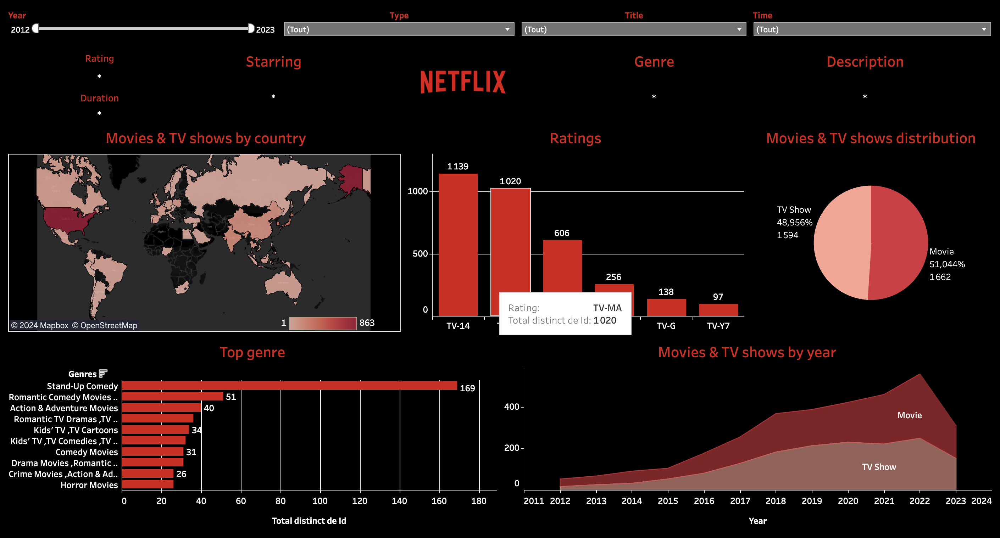

# Netflix Movies and TV Shows Dashboard using Tableau

Test

## Overview

This project presents an interactive Tableau dashboard focused on Netflix's extensive library of movies and TV shows. With over 3000+ titles available on their platform, the dashboard offers insights into key details such as cast, directors, ratings, release year, and duration. 

## Preview

## About this Dataset

Netflix is one of the most popular media and video streaming platforms, boasting over 200 million subscribers globally as of mid-2021. This tabular dataset consists of listings of all the movies and TV shows available on Netflix, along with details such as cast, directors, ratings, release year, duration, etc.

## Tools Used

- Tableau

## Usage

To explore the dashboard:

1. Download Tableau desktop application.
2. Clone this repository.
3. Open `Netflix_dasboard_v2023.1.twbx` with Tableau.
4. Interact with the dashboard.

## Contact

For inquiries and collaborations, feel free to reach out to huutri231103@gmail.com.